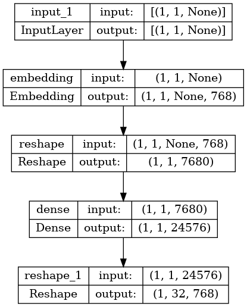

# am2en

## Get parallel text for training
```
cd ../..
git clone https://github.com/MarsPanther/Amharic-English-Machine-Translation-Corpus
```

## Build the translation model and train it with parallel text

```
cd am-llm/models
./am2en.py --train 32
```

Model layers look like this:





## Translate from amharic on stdin to english on stdout
```
echo "ሰላም ዓለም" | ./am2en.py --predict
```